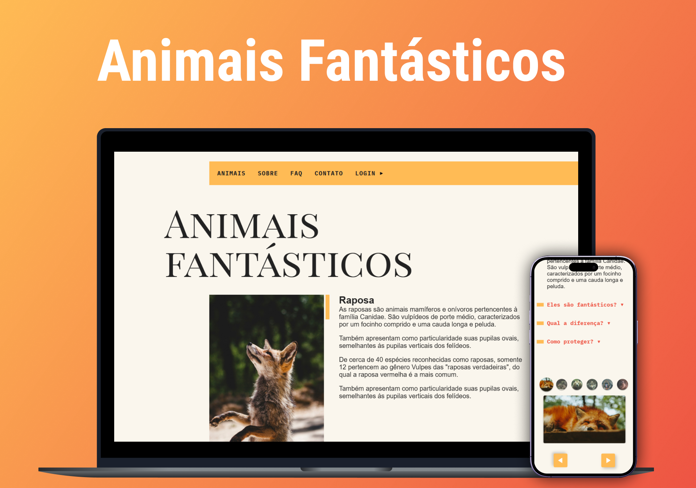

<h1 align="center"> Aniamis Fantásticos </h1>

 Projeto realizado durante o curso de JavaScript da plataforma Origamid.  

  <a href="#tecnologias">Tecnologias</a>&nbsp;&nbsp;&nbsp;|&nbsp;&nbsp;&nbsp;
  <a href="#projeto">Projeto</a>

  

 

  

<h2 id="#tecnologias">🚀 Tecnologias</h2>

Esse projeto foi desenvolvido com as seguintes tecnologias:

- HTML
- CSS
- JavaScript

Além disso, foram desenvolvidas as seguintes habilidades: 

- Manipulação de objetos, strings e arrays
- Promises e Fetch API
- Expressões Regulares (RegExp)
- Gerenciamento de pacotes com NPM
- Controle de versão com Git
- Configuração e uso do Babel e Webpack

<h2 id="projeto">💻 Projeto</h2>

Animais Fantásticos é um site desenvolvido durante o curso de JavaScript da Origamid, onde pude aprofundar meus conhecimentos na linguagem de forma prática.

O projeto consiste em um site informativo sobre diferentes animais, permitindo explorar conteúdos dinâmicos e interativos. Durante o desenvolvimento, implementei diversas funcionalidades, como um carrossel criado do zero, manipulação do DOM e interações avançadas com JavaScript puro.

Além disso, trabalhei com promises, fetch API, expressões regulares (RegExp) e conceitos fundamentais para estruturar aplicações modernas com Babel e Webpack.

